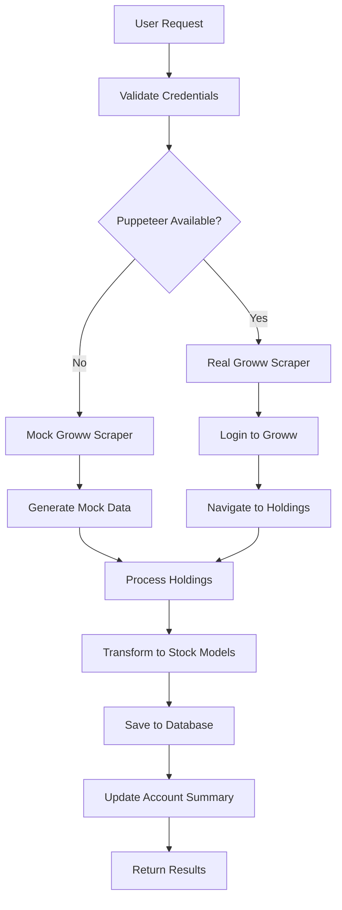

# Groww Scraping Integration Documentation

## Overview
This document describes the comprehensive Groww portfolio scraping integration that allows users to automatically sync their investment data from the Groww platform into the investment portfolio application.

## Architecture

### Components
1. **GrowwScraper** (`/services/scraping/groww.js`) - Real Puppeteer-based scraper
2. **MockGrowwScraper** (`/services/scraping/mockGroww.js`) - Mock scraper for development
3. **ScrapingService** (`/services/scrapingService.js`) - Integration service
4. **Account Controller** - API endpoints for sync operations

## API Endpoints

### POST `/api/accounts/:id/sync`
Sync account holdings from Groww platform.

**Request Body:**
```json
{
  "username": "your@email.com",
  "password": "your_password",
  "pin": "1234",
  "otp": "123456"  // Optional, if required
}
```

**Response:**
```json
{
  "success": true,
  "message": "Successfully synced 4 mock holdings from Groww (demo mode)",
  "data": {
    "account": {
      "id": "acc-001",
      "name": "Main Brokerage Account",
      "balance": 75829.65,
      "metadata": {
        "totalInvestment": 74790,
        "totalProfitLoss": 1039.65,
        "lastSyncedAt": "2025-08-10T11:03:12.953Z",
        "source": "groww"
      }
    },
    "stocks": [
      {
        "accountId": "acc-001",
        "symbol": "RELIANCE",
        "name": "Reliance Industries Ltd",
        "quantity": 10,
        "purchasePrice": 2350,
        "currentPrice": 2450.75,
        "sector": "Energy",
        "exchange": "NSE",
        "currentValue": 24507.5,
        "initialValue": 23500,
        "gainLoss": {
          "absolute": 1007.5,
          "percentage": 4.29
        },
        "metadata": {
          "source": "groww",
          "profitLossPercentage": 4.29,
          "dailyChangePercentage": 1.2,
          "marketCap": "Large Cap",
          "subSector": "Oil & Gas",
          "scrapedAt": "2025-08-10T11:03:12.951Z"
        }
      }
    ],
    "summary": {
      "totalStocks": 4,
      "totalValue": 75829.65,
      "totalInvestment": 74790,
      "totalProfitLoss": 1039.65,
      "syncedAt": "2025-08-10T11:03:12.953Z"
    },
    "isMockData": true
  }
}
```

### GET `/api/accounts/:id/sync/status`
Get synchronization status for an account.

**Response:**
```json
{
  "success": true,
  "data": {
    "accountId": "acc-001",
    "accountName": "Main Brokerage Account",
    "lastSyncedAt": "2025-08-10T11:03:12.953Z",
    "totalSyncedStocks": 4,
    "hasGrowwData": true,
    "totalValue": 75829.65,
    "totalInvestment": 74790,
    "totalProfitLoss": 1039.65
  }
}
```

### DELETE `/api/accounts/:id/sync`
Clear all synced data for an account.

**Response:**
```json
{
  "success": true,
  "message": "Sync data cleared successfully"
}
```

## Data Flow

### 1. Sync Process


### 2. Data Transformation
- Raw scraped data → Stock model validation → JSON storage
- Account balance updated with portfolio total value
- Metadata preserved for tracking data source

### 3. Data Persistence
- Stocks saved to `stocks.json` with `metadata.source = "groww"`
- Account updated with sync timestamp and totals
- Previous synced data replaced on new sync

## Scraped Data Fields

### Stock Holdings
- **Basic Info**: Symbol, name, quantity
- **Pricing**: Purchase price, current price, daily change %
- **Performance**: Profit/loss %, absolute gains/losses
- **Classification**: Sector, sub-sector, market cap, exchange
- **Metadata**: Scraping timestamp, data source

### Portfolio Summary
- **Total Value**: Current portfolio value
- **Total Investment**: Initial investment amount
- **Total Profit/Loss**: Overall gains/losses
- **Last Updated**: Sync timestamp

## Development vs Production

### Development Mode (Mock Scraper)
- **Triggered when**: Puppeteer dependencies not installed
- **Data Source**: Realistic mock Indian stock data
- **Stocks**: RELIANCE, TCS, HDFCBANK, INFY
- **Features**: All API functionality without browser automation

### Production Mode (Real Scraper)
- **Requirements**: Puppeteer dependencies installed
- **Install Command**: `npm run install-scraping`
- **Features**: 
  - Real browser automation
  - Stealth mode to avoid detection
  - Handles OTP and PIN authentication
  - Live data scraping from Groww

## Installation & Setup

### For Development (Mock Mode)
```bash
# No additional setup required
# Mock scraper works out of the box
curl -X POST http://localhost:5001/api/accounts/acc-001/sync \
  -H "Content-Type: application/json" \
  -d '{"username":"test","password":"test","pin":"1234"}'
```

### For Production (Real Scraping)
```bash
# Install Puppeteer dependencies
npm run install-scraping

# Restart server
npm run dev

# Use real credentials
curl -X POST http://localhost:5001/api/accounts/acc-001/sync \
  -H "Content-Type: application/json" \
  -d '{
    "username": "your@email.com",
    "password": "your_password",
    "pin": "1234",
    "otp": "123456"
  }'
```

## Security Considerations

### Credential Handling
- **Never stored**: Credentials are only used for authentication
- **Memory only**: Credentials exist only during scraping session
- **No logging**: Sensitive data not logged to console/files

### Browser Security
- **Stealth mode**: Puppeteer-extra-plugin-stealth to avoid detection
- **User agent**: Realistic browser fingerprinting
- **Headless mode**: Can be disabled for debugging (set `headless: false`)

### Data Privacy
- **Local storage**: All data stored locally in JSON files
- **No external calls**: Data never sent to third-party services
- **Metadata tracking**: Clear audit trail of data sources

## Error Handling

### Common Error Scenarios
1. **Invalid credentials**: Returns authentication failure
2. **Network issues**: Graceful timeout and retry logic
3. **Captcha/Security**: Manual intervention required
4. **Site changes**: Selector updates may be needed
5. **Missing dependencies**: Automatic fallback to mock mode

### Error Response Format
```json
{
  "success": false,
  "message": "Login failed: Invalid credentials",
  "error": "Authentication error",
  "requiresOTP": true  // If OTP is needed
}
```

## Monitoring & Debugging

### Logging
- Console logs for each major step
- Error tracking with full stack traces
- Sync timestamps for audit trails

### Debug Mode
```javascript
// In groww.js, set headless: false for visible browser
this.browser = await puppeteer.launch({
  headless: false,  // See browser actions
  slowMo: 50       // Slow down for debugging
});
```

### Status Monitoring
```bash
# Check sync status
curl http://localhost:5001/api/accounts/acc-001/sync/status

# View synced stocks
curl http://localhost:5001/api/stocks/account/acc-001

# Clear and re-sync
curl -X DELETE http://localhost:5001/api/accounts/acc-001/sync
curl -X POST http://localhost:5001/api/accounts/acc-001/sync -d '{...}'
```

## Future Enhancements

### Planned Features
1. **Scheduled Syncing**: Automatic periodic updates
2. **Multiple Brokers**: Support for Zerodha, Angel One, etc.
3. **Real-time Updates**: WebSocket integration for live prices
4. **Advanced Analytics**: Performance tracking, risk analysis
5. **Notification System**: Alerts for significant changes

### Technical Improvements
1. **Database Migration**: Move from JSON to PostgreSQL
2. **Caching Layer**: Redis for frequently accessed data
3. **Queue System**: Background job processing for syncs
4. **API Rate Limiting**: Prevent abuse of sync endpoints
5. **Audit Logs**: Comprehensive operation tracking

## Troubleshooting

### Common Issues

**Issue**: "Puppeteer not available"
```bash
# Solution: Install dependencies
npm run install-scraping
```

**Issue**: "Login failed"
```bash
# Check credentials and try with OTP
curl -X POST .../sync -d '{"username":"...","password":"...","pin":"...","otp":"123456"}'
```

**Issue**: "Sync data not clearing"
```bash
# Verify metadata.source field exists
curl http://localhost:5001/api/stocks/account/acc-001 | jq '.[0].metadata.source'
```

**Issue**: "Browser timeout"
```bash
# Increase timeout in groww.js or check network connectivity
```

This integration provides a robust foundation for automated portfolio synchronization with comprehensive error handling and development-friendly fallbacks.
